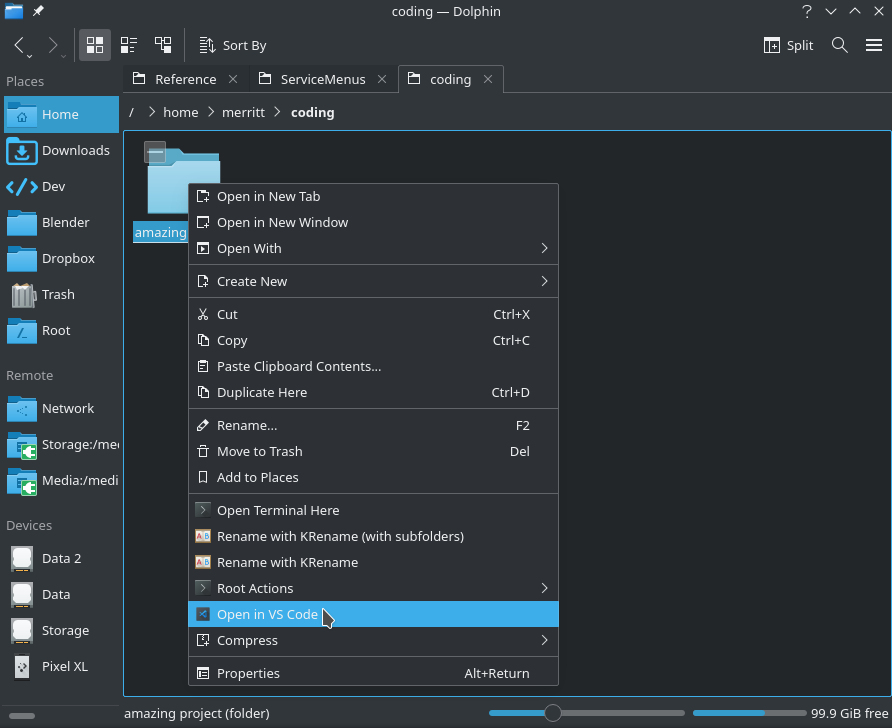
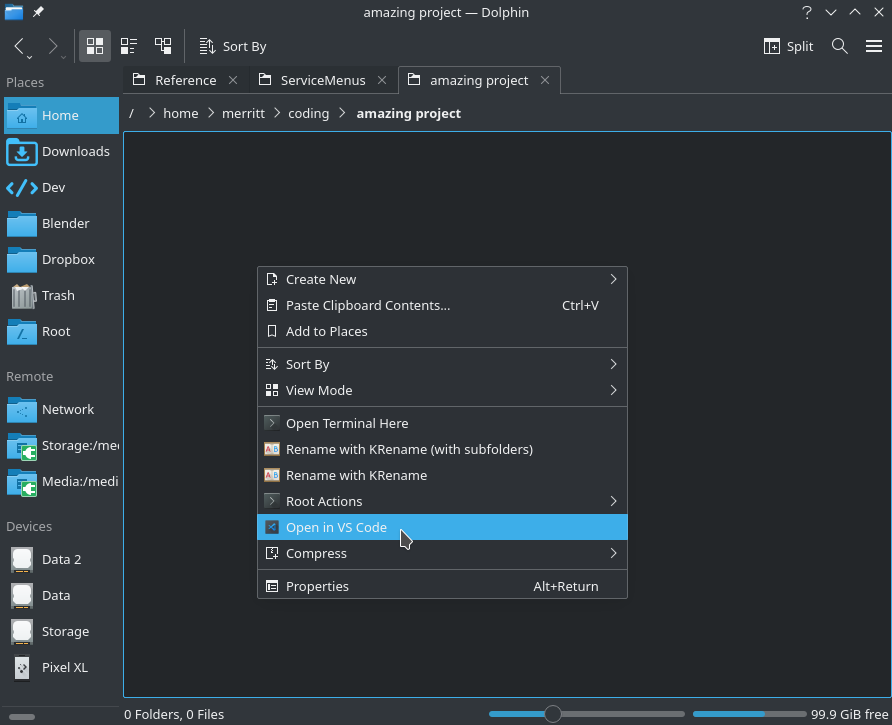

# Dolphin: Open in VS Code

A context menu entry for Dolphin to open VS Code at the current location.

Works on the empty background or on a folder.

## Download

<a href="https://store.kde.org/p/1413799/"></a>
<a href="https://github.com/Merrit/kde-dolphin-open-vscode/releases/latest"></a>

## Manual Install

If not downloading from the KDE Store, install manually:

Move the file `openVSCode.desktop` into the [Service Menus folder](https://develop.kde.org/docs/apps/dolphin/service-menus/):
- KDE Plasma 5: `~/.local/share/kservices5/ServiceMenus`
- KDE Plasma 6: `~/.local/share/kio/servicemenus`

Set as executable:
```bash
chmod +x ./openVSCode.desktop
```

## Customization

By default, the extension works on directories (i.e. `inode/directory`). If you prefer the extension to work on all file types, edit the file `openVSCode.desktop` by replacing the line `MimeType=inode/directory` with `MimeType=all/all`.

## Screenshots




